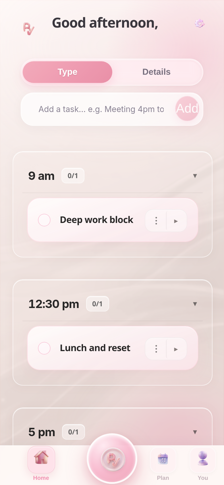
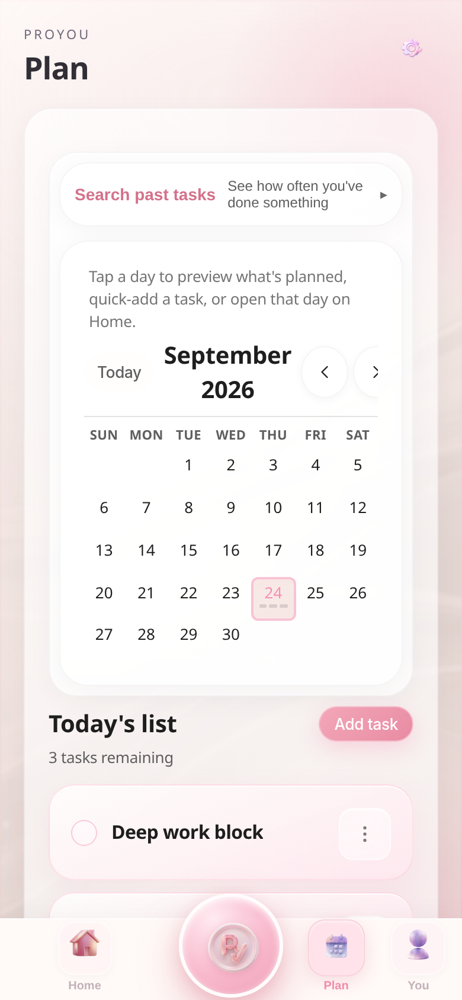
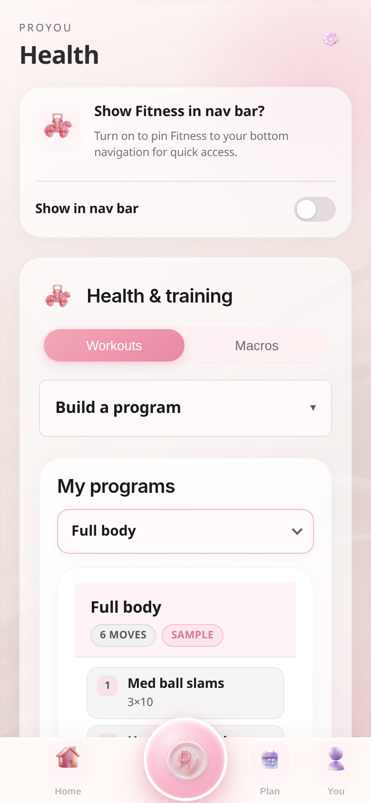
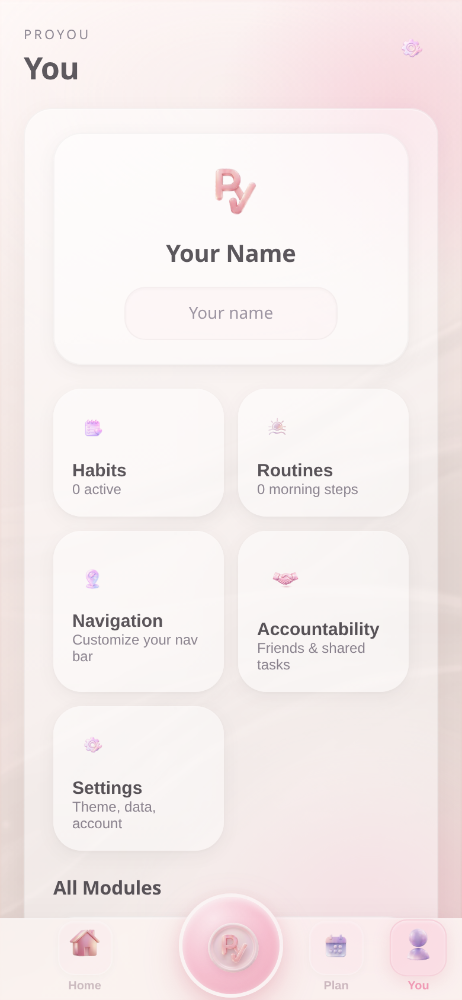

# Pro You

GitHub slug is `cute-schedule` (legacy); npm/iOS brand is Pro You.

A planning and accountability app for schedule, habits, health, finance, and an AI coach — on the web and on iOS.

Pro You is a full product (web + Capacitor iOS), not a toy schedule demo. The web client is Vite and React. The iOS client is Capacitor (`app.proyou.proyou`). The same product includes Vercel serverless APIs, Firebase Auth/Firestore, RevenueCat subscriptions, and Upstash Redis rate limits.

**Live app:** [https://cute-schedule.vercel.app](https://cute-schedule.vercel.app)

<table>
  <tr>
    <td width="25%"></td>
    <td width="25%"></td>
    <td width="25%"></td>
    <td width="25%"></td>
  </tr>
  <tr>
    <td align="center">Home</td>
    <td align="center">Plan</td>
    <td align="center">Health</td>
    <td align="center">You</td>
  </tr>
</table>

Screenshots are the live web app in a guest session (September 2026). The three Home tasks were typed in that session so the schedule UI is visible. Storage keys such as `cute-schedule-data` are unchanged and must not be renamed.

## Product capabilities

- Daily plans and time-blocked schedules
- Reusable routines and habit tracking
- Monthly objectives and progress views
- Notes, health, medication, and finance workflows
- Capacity and energy-aware planning
- Timers, reminders, and accountability sharing
- Insight and coaching surfaces
- Mobile-ready web experience with iOS packaging support

## Stack

| Layer | What |
| --- | --- |
| Client | React 19, Vite 7, Capacitor 7 (iOS) |
| API | Vercel Node functions under `api/` |
| Auth / data | Firebase Auth, Firestore (`schedules`, social) |
| Billing | RevenueCat (iOS StoreKit) with server-side entitlement verify |
| Push | FCM + Web Push (VAPID) + iOS AlarmKit / local notifications |
| Coach | OpenAI via `/api/coach`, quota + entitlement in `api/lib/coachEntitlement.js` |

## Scripts

```bash
npm install
npm run dev          # Vite
npm test             # node:test + tsx (all *.test.mjs)
npm run typecheck    # tsc --noEmit (strict, src TypeScript)
npm run lint:api     # API, scripts, tests (CI gate)
npm run lint         # full client ESLint (existing JSX hook debt)
npm run build        # typecheck then vite build
npm run ci           # lint:api + test + typecheck + build
```

Node 20 is required (`engines.node`). GitHub Actions `CI` runs lint, unit tests, typecheck, and production build on pull requests and on `main`. The Vercel deploy workflow still requires a passing verify job first.

## Tests

`scripts/run-tests.mjs` discovers `*.test.mjs` (skipping `docs/`, `ios/`, `node_modules/`) and runs them with `node --import tsx --test`. Coverage includes:

- **Access:** subscription features, 30-day trial, admin/pilot Pro, free coach quota (client + server)
- **Auth / cloud:** user-facing error sanitization (no Firebase leakage), Firestore hour-key codec for schedule payloads
- **Notifications:** reminder payload normalize, APNs/FCM token checks, task reminder rows
- **Billing:** RevenueCat subscriber verify (mocked HTTP)
- **Coach:** reasoning mode, suggestion parse, specificity, learning memory, server validate
- **Social / Firestore access policy:** profile reads, friendship creation (invite code or accepted request), referral rewards, shared-task membership
- **Domain:** intake/period privacy, habits, task history search, alarm sounds, social snapshot filter
- **API:** CORS, nutrition-label handler (OPTIONS/POST/config), VAPID env, RevenueCat verify

`npm run lint:api` is the CI lint (server, scripts, tests). `npm run lint` still runs the full React ESLint config on the client; that surface has existing hook-rule debt in large JSX files and is not a CI gate.

## TypeScript

TypeScript is pinned to **5.9** (stable). Domain modules under `src/coach/` and `src/social/` (`socialModel`, `firestoreAccess`, `referralEntitlement`) are TypeScript. Remaining UI is JSX; `npm run build` fails if `tsc --noEmit` fails.

## Layout

```
api/                 Vercel functions + shared lib (entitlement, CORS, push, Redis)
src/                 React app, coach TS, subscription, social, native bridges
ios/App/             Capacitor shell, AlarmKit, widgets, OCR plugin
firestore.rules      Social + schedule security rules
docs/                iOS plugins, AlarmKit, nutrition-label OCR port
```

## Product approach

The central design constraint is that a planning tool should reduce cognitive load rather than create another backlog to maintain. Features are organized around the user's current capacity, immediate next action, and continuity across days.

## Ownership

Designed and engineered by Sarah Kitay.
